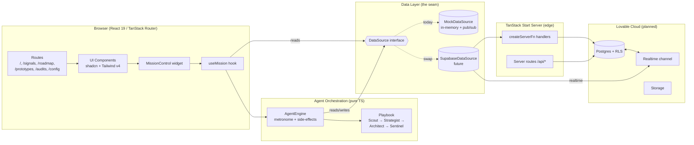
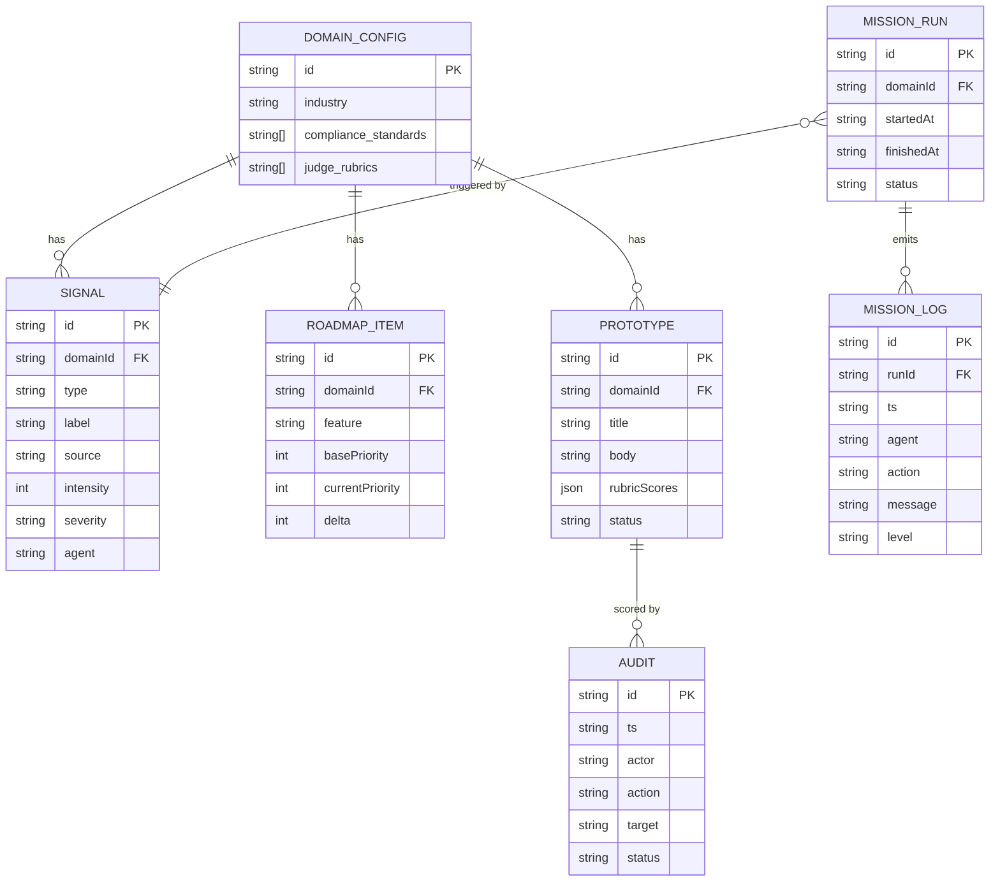
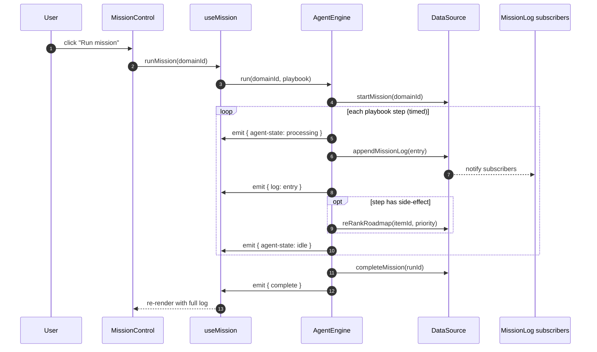
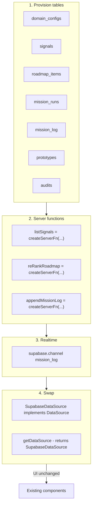

# Architecture — Signals Command Center

A domain-agnostic OODA-loop console for product strategy. Four AI agents
(Scout · Strategist · Architect · Sentinel) observe the world, re-rank the
roadmap, draft prototypes, and audit them against domain rubrics.

The app is shipped as a **TanStack Start v1** application (React 19 + Vite 7)
with an intentionally thin persistence seam so the UI can run today against
in-memory mocks and tomorrow against a real Lovable Cloud (Postgres) backend
**without changing a single component**.

---

## 1. High-level architecture



---

## 2. Frontend

### Stack

| Layer | Choice | Notes |
|---|---|---|
| Framework | TanStack Start v1 (React 19) | SSR-capable; routes auto-generated from `src/routes/` |
| Bundler | Vite 7 | Edge-targeted (Cloudflare Workers) |
| Styling | Tailwind v4 + `src/styles.css` design tokens | OKLCH semantic tokens, dark by default |
| UI kit | shadcn/ui primitives | `src/components/ui/*` |
| Routing | `@tanstack/react-router` (file-based) | `src/routes/__root.tsx` is the shell |
| State | Local component state + a typed `DataSource` singleton | No global store needed |
| Async | `setTimeout`-driven engine + DataSource pub/sub | TanStack Query is available for future Cloud reads |

### Routes

| Path | Role |
|---|---|
| `/` | Landing — domain picker (Health-Tech / Cybersecurity / Custom) |
| `/signals` | Scout inbox + signal detail + **Mission Control** widget |
| `/roadmap` | Strategist's re-ranked feature list with deltas |
| `/prototypes` | Architect's drafted artifacts |
| `/audits` | Sentinel's pass/warn/fail rubric checks + audit trail |
| `/config` | Domain config / rubrics editor |

### Key files

```
src/
├── routes/                       # File-based routes (TanStack Router)
├── components/
│   ├── mission-control.tsx       # The agent visualiser (pulses + log)
│   ├── app-sidebar.tsx
│   └── ui/*                      # shadcn primitives
├── hooks/
│   └── use-mission.ts            # Subscribes to AgentEngine events
├── lib/
│   ├── agents/engine.ts          # AgentEngine + default playbook
│   ├── data/
│   │   ├── types.ts              # Domain entities (the contract)
│   │   ├── source.ts             # DataSource interface + getDataSource()
│   │   ├── mock-source.ts        # In-memory implementation
│   │   └── configs.ts            # Seed signals / roadmap / domain configs
│   ├── mock-data.ts              # Legacy fixtures used by static pages
│   └── app-store.ts              # Domain + mode context
└── styles.css                    # OKLCH design tokens
```

### Design tokens

Every colour is a semantic token in `src/styles.css` (`--background`,
`--action`, `--observe`, `--orient`, `--decide`, `--act`, `--success`,
`--warning`, `--danger`). Components never use raw hex / Tailwind colour
classes — the theme is single-source-of-truth.

---

## 3. The data layer (the seam)

The single most important architectural decision: **the UI never touches
storage directly**. It calls `getDataSource()` and consumes a typed
`DataSource` interface. Today that returns an in-memory mock; tomorrow it
returns a Supabase-backed implementation. Nothing else changes.

### Contract — `src/lib/data/source.ts`

```ts
interface DataSource {
  // Reads
  listDomains(): Promise<DomainConfig[]>;
  listSignals(domainId?: string): Promise<SignalRecord[]>;
  listRoadmap(domainId?: string): Promise<RoadmapRecord[]>;
  listMissionLog(runId?: string): Promise<MissionLogEntry[]>;
  listAudits(): Promise<AuditRecord[]>;
  listPrototypes(domainId?: string): Promise<PrototypeRecord[]>;

  // Writes
  appendMissionLog(entry): Promise<MissionLogEntry>;
  reRankRoadmap(itemId, newPriority, reason): Promise<RoadmapRecord>;
  startMission(domainId, triggerSignalId?): Promise<MissionRun>;
  completeMission(runId): Promise<MissionRun>;

  // Reactive (mock = pub/sub Set; cloud = supabase realtime)
  subscribeMissionLog(cb): () => void;
}
```

### Entities (mirror future Postgres tables)



---

## 4. The agent orchestration engine

`src/lib/agents/engine.ts` ports the source repo's playback simulation into
pure TypeScript. It is **not** React-aware — it drives a `DataSource` and
emits events. The React layer subscribes via `useMission`.



### Default playbook (faithful port of source repo)

1. **Scout** — `SIGNAL_DETECTED` (intensity spike)
2. **Strategist** — `PRIORITY_SHIFT` → re-ranks roadmap (real DataSource write)
3. **Architect** — `VIBE_CODING_INITIATED` (drafts artifact)
4. **Sentinel** — `AUDIT_FAILED` (Will-Protocol violation)
5. **Architect** — `SELF_CORRECTION`
6. **Sentinel** — `AUDIT_PASSED`

---

## 5. Backend — today and tomorrow

### Today (in-memory)

There is no network call. `MockDataSource` is a singleton class that holds
arrays + a `Set<listener>` for pub/sub. State persists for the tab lifetime.
This keeps the demo fully deterministic and offline.

### Tomorrow (Lovable Cloud)

The TanStack Start template already provisions:

- `@/integrations/supabase/client` — browser client (RLS, publishable key)
- `@/integrations/supabase/auth-middleware` — `requireSupabaseAuth` for protected server fns
- `@/integrations/supabase/client.server` — admin client (service role, server-only)
- `createServerFn` — typed RPC for server logic
- `src/routes/api/*` — file-based HTTP endpoints for webhooks

When Lovable Cloud is enabled the migration is mechanical:



Only `src/lib/data/source.ts` (1 file) and a new `supabase-source.ts` are
touched. Routes, hooks, components, and the agent engine are untouched.

---

## 6. Security posture

- **No secrets in the client.** `client.server.ts` (service role) is
  bundle-blocked from the browser via the `*.server.ts` convention.
- **RLS first.** When Cloud is enabled, every read/write goes through
  `requireSupabaseAuth` and respects row-level security — `supabaseAdmin` is
  reserved for trusted maintenance jobs and verified webhooks.
- **Webhook routes** live under `src/routes/api/public/*` and must verify
  HMAC signatures before touching the DB.
- **Roles** (when added) live in a separate `user_roles` table with a
  `SECURITY DEFINER` `has_role()` function — never on the profile row.

---

## 7. Why this shape

| Concern | How the architecture solves it |
|---|---|
| Demo today, real product tomorrow | Same UI, swap one factory function |
| Domain-agnostic ("Operating System") | `DomainConfig` + seed tables, hot-swappable per tenant |
| Auditable agents | Every agent action goes through `appendMissionLog` — one table = full trail |
| Deterministic playback for sales pitches | `AgentEngine` is pure TS with explicit timings |
| Realtime when Cloud is on | `subscribeMissionLog` already exists; map it to `supabase.channel(...)` |
| Edge-deployable | Engine + DataSource are zero-Node; SSR-safe |
