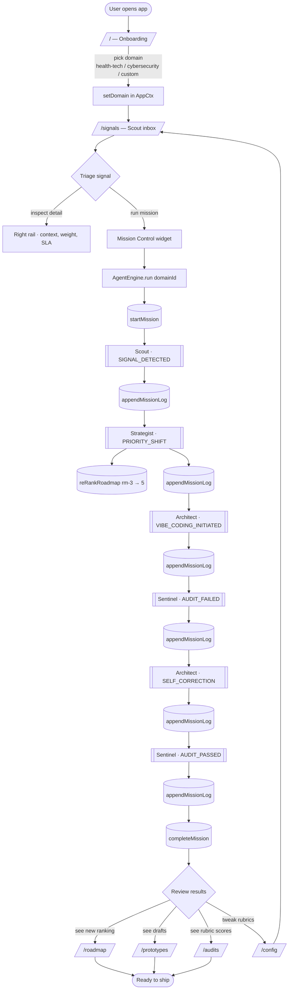
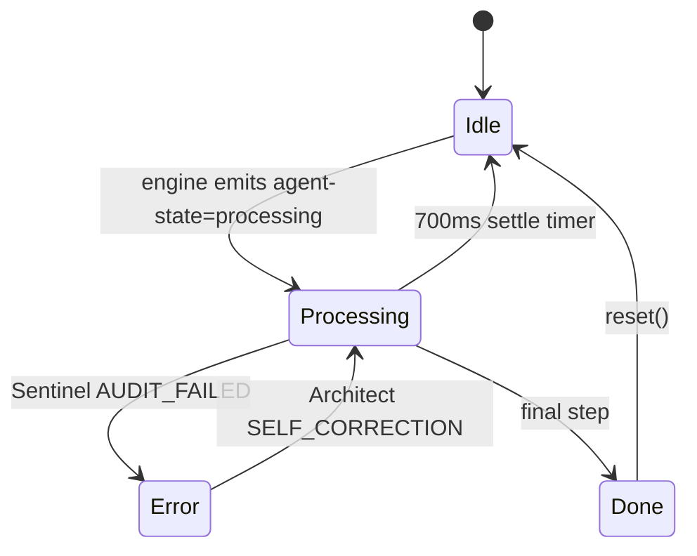
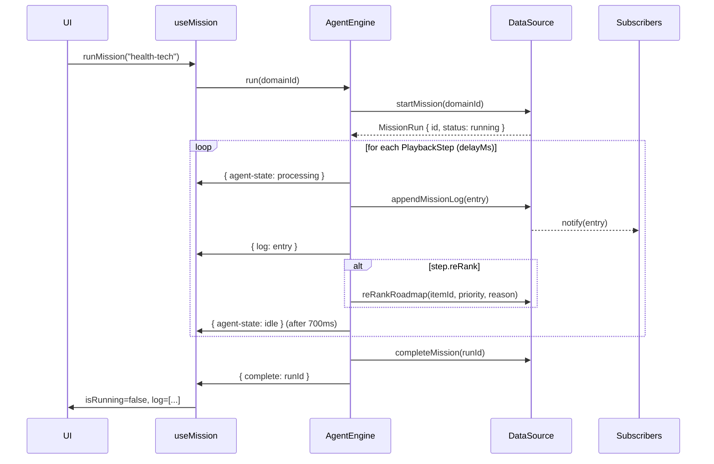

# Workflow — Signals Command Center

How a strategic mission flows through the application, from a user landing
on the home page to Sentinel signing off on a prototype. Every step below
maps directly to a route, a component, or a `DataSource` call in the
codebase — there is no narrative fiction.

---

## 1. End-to-end workflow diagram

---

## 2. Step-by-step narrative

### Step 1 — Land and choose a domain (`/`)

`src/routes/index.tsx` renders three domain cards (Health-Tech,
Cybersecurity, Custom JSON). Clicking a card calls `setDomain()` from
`AppCtx` and routes to `/signals`. The choice loads the matching seed
config (`src/lib/data/configs.ts`) — same UI, different signals, roadmap,
and judge rubrics. This is the "metadata-driven" pivot point.

### Step 2 — Triage in the Scout inbox (`/signals`)

`src/routes/signals.tsx` is a three-column layout:

| Column | Content | Source |
|---|---|---|
| Left | Filterable signal list, sorted by severity / freshness | `DataSource.listSignals()` |
| Centre | Selected signal detail + agent trace | static fixture, will move to `signals` table |
| Right rail | **Mission Control** + context (affected roadmap items, Sentinel risk, SLA, weight breakdown) | `useMission()` hook |

The user can either inspect signals manually or hand the floor to the
agents by pressing **Run mission**.

### Step 3 — Run a mission (Mission Control)

`src/components/mission-control.tsx` calls `useMission().runMission(domainId)`,
which instantiates an `AgentEngine` (`src/lib/agents/engine.ts`). The engine
walks the **default playbook** on a metronome (timed `setTimeout`s):

| t (ms) | Agent | Action | Side-effect |
|---:|---|---|---|
| 0 | Scout | `SIGNAL_DETECTED` | log |
| 1200 | Strategist | `PRIORITY_SHIFT` | log + `reRankRoadmap("rm-3", 5)` |
| 2400 | Architect | `VIBE_CODING_INITIATED` | log |
| 3800 | Sentinel | `AUDIT_FAILED` | log (level=error) |
| 5000 | Architect | `SELF_CORRECTION` | log |
| 6200 | Sentinel | `AUDIT_PASSED` | log (level=success) → `completeMission` |

Every step does three things: pulse the agent's status dot, append a row
to `mission_log` via the `DataSource`, and (for Strategist) mutate the
roadmap. Subscribers (`subscribeMissionLog`) receive the entry in
real time — today via an in-memory `Set<listener>`, tomorrow via Supabase
Realtime, with no UI change.

### Step 4 — See the consequences

After the mission completes the user navigates the four downstream
surfaces and watches the world reshape:

- **`/roadmap`** — the Strategist's re-rank is visible (delta column,
  cyan glow on the elevated item).
- **`/prototypes`** — Architect's drafts (today: fixtures; tomorrow:
  rows from the `prototypes` table populated by the server-side agent
  during the run).
- **`/audits`** — Sentinel's rubric breakdown: pass / warn / fail per
  category, plus the chronological audit trail.
- **`/config`** — the domain config: compliance standards and
  `judge_rubrics` that drive what Sentinel checks.

Editing config and re-running the mission is the inner loop of the demo:
**change a rule → re-run → watch the agents react differently.**

---

## 3. Per-agent state machine

Each of the four agents owns one of these state machines. Mission Control
renders five dots (Scout · Strategist · Architect · Sentinel + System); the
active dot pulses while `Processing`.

---

## 4. Mission lifecycle (data view)

Re-pressing **Run mission** calls `engine.abort()` first, clears all
timers, resets agent dots, and starts fresh — there is no orphaned timer
state.

---

## 5. What "no backend" means today vs. tomorrow

| Capability | Today (mock) | With Lovable Cloud |
|---|---|---|
| Read signals | `MockDataSource.signals` array | `select * from signals where domain_id = $1` |
| Append log | `array.push` + `Set` notify | `insert into mission_log` + Realtime broadcast |
| Re-rank | mutate object in place | `update roadmap_items set current_priority = ...` (server fn) |
| Persistence across reload | none | full |
| Multi-user | single tab | RLS-scoped per workspace |
| Webhooks (real Scout) | n/a | `src/routes/api/public/scout-webhook.ts` |

The migration is **one factory function** in `src/lib/data/source.ts` plus
a new `supabase-source.ts` — every route, hook, and component is already
written against the `DataSource` interface and stays untouched.

---

## 6. Inner loop for a demo

1. Open `/` → pick **Health-Tech**.
2. Land on `/signals` → scroll the Scout inbox, click the critical signal.
3. Press **Run mission** in Mission Control. Watch agent dots pulse and
   the typewriter log fill in real time.
4. Switch to `/roadmap` → confirm the Strategist's re-rank.
5. Switch to `/audits` → confirm Sentinel's pass/fail rubric breakdown.
6. Switch to `/config` → flip a compliance standard, return to `/signals`,
   re-run. Sentinel's narrative changes accordingly.

That round trip is the entire product loop — Observe → Orient → Decide →
Act → Audit → repeat.
